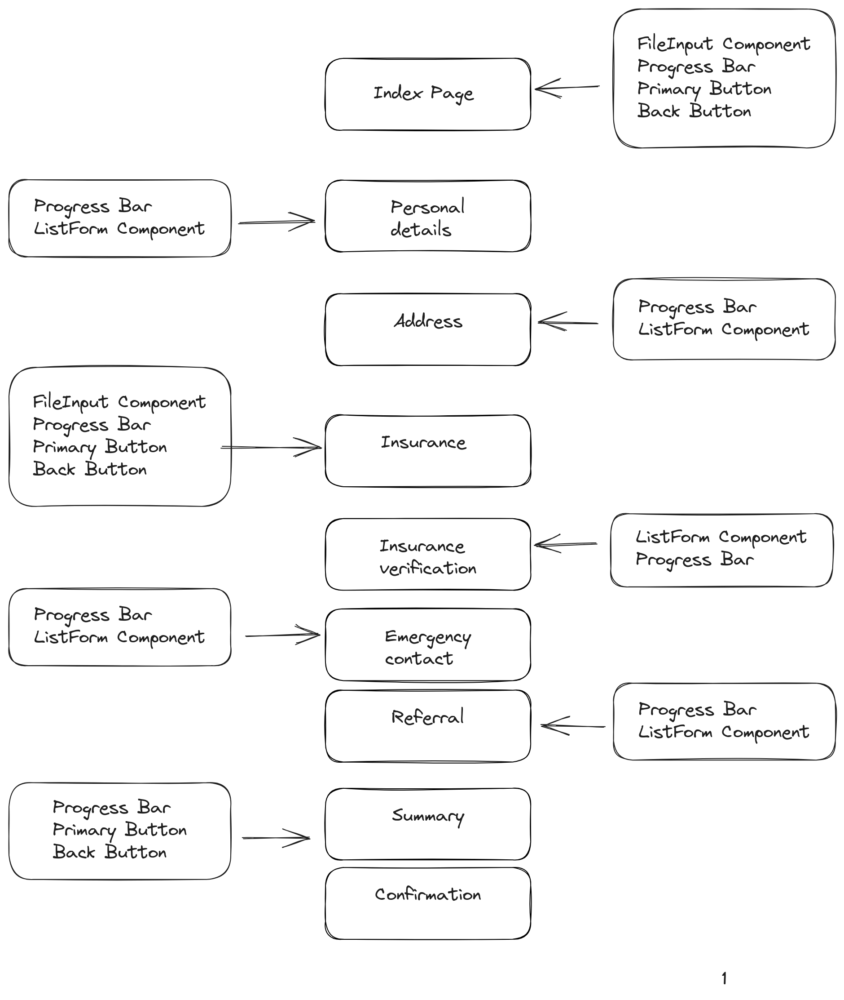

# Components and Pages Guildlines

## [Components](components/)
1. [`BackButton.vue`](components/BackButton.vue) - It is used to navigate back one screen using nuxt router. It has a goBack function which is called on click event.
2. [`FileInput.vue`](components/FileInput.vue) - It is used to take file as input from user. It has `fileName` reactive variable to have the latest updated file.
3. [`ListFormComp.vue`](components/ListFormComp.vue) - It is component which creates a group of inputs based on the given `inputArray` and have both `BackButton` and `NextButton` for navigation 
4. [`NavBar.vue`](components/NavBar.vue) - It is navbar which contains the client's name and logo which is attached to a nuxt link to Home Page and it also has contact info
5. [`PrimaryButton.vue`](components/PrimaryButton.vue) - It is also a button components which goes to `page` given as input
6. [`ProgressBarComp.vue`](components/ProgressBarComp.vue) -  It shows the current progress of the patient intake form. It takes in a `stepValue` which is used to calculate the current status of the form. 
7. [`SelectOption.vue`](components/SelectOption.vue) - It is the selection input (dropdown) type components which takes in the options array and label title as input. 
8. [`SingleInput.vue`](components/SingleInput.vue) - It is the input field component which takes in the input label name, value of the field and required boolean.
   
## [Pages](pages/)
1. [`index.vue`](pages/index.vue) - It is `/` route. It is used to take file input from the user.
2. [`personalDetails.vue`](pages/personalDetails.vue) -  It is `/personalDetails` route. It is used to verify the user's personal details and get some new information.
3. [`address.vue`](pages/address.vue) -  It is `/address` route. It is used to verify user's address information and get the mailing address information.
4. [`insurance/index.vue`](pages/insurance/index.vue) - It is `/insurance` route. It is used to take in the user's insurance front page and back page.
5. [`insurance/verify.vue`](pages/insurance/verify.vue) -  It is `/insurance/verify` route. It used to get user's group number and member ID.
6. [`contact.vue`](pages/contact.vue) - It is `/contact` route. It is used to get the user's emergency contact information.
7. [`referral.vue`](pages/referral.vue) - It is `/referral` route. It is used to get referral doctor information.
8. [`confirm.vue`](pages/confirm.vue) - It is `/confirm` route. It gives a quick summary of the user's details and have the terms and conditions for user to accept for confirmation.
9. [`success.vue`](pages/success.vue) - It is `/success` route. It the end of the application which shows the result of their registration.

